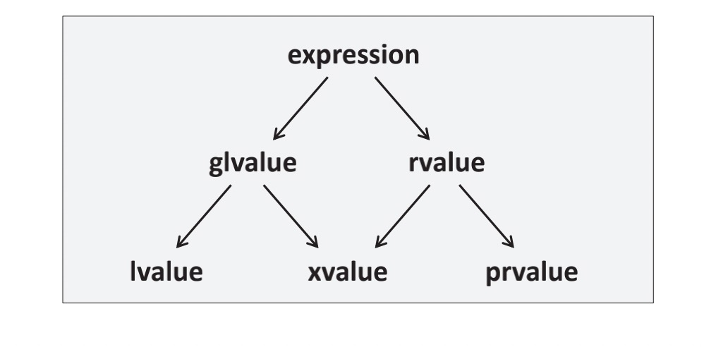
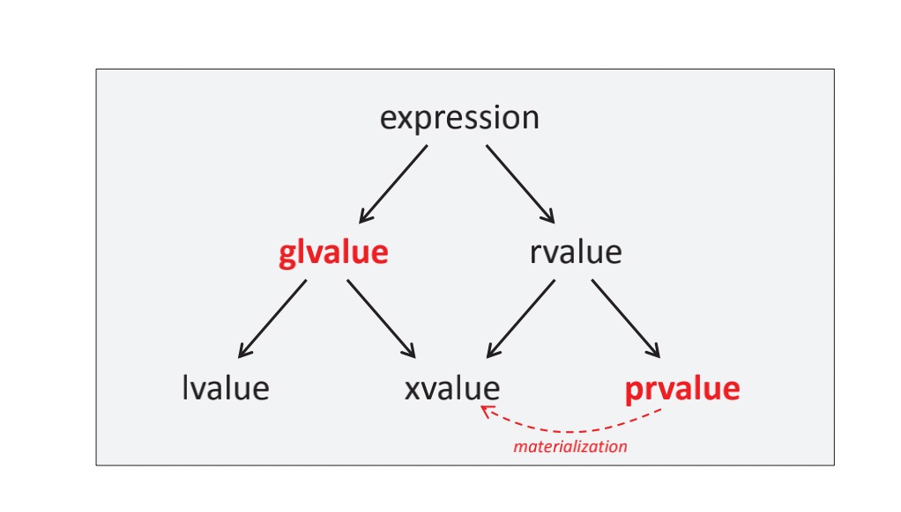

# 第五章 强制拷贝消除或者传递unmaterialized对象
本章的主题可以从两个角度来看：
+ C++17引入了新的规则，在确定条件下可以强制消除拷贝：以前临时对象传值或者返回临时对象期间发生的拷贝操作的消除是可选的，现在是强制的。
+ 因此，我们处理传递未具体化对象的值以进行初始化
我将从技术上介绍这个特性，然后讨论具体化（materialization）的效果和相关术语。

## 5.1 临时量强制拷贝消除的动机
标准伊始，C++就明确允许一些拷贝操作可以被省略（消除），不调用拷贝构造函数会失去可能存在的副作用，从而可能影响程序的行为，即便这样也在所不惜。强制拷贝消除的场景之一是使用临时对象初始化新对象。这个情况经常发生，尤其是以值传递方式将临时对象传递给一个函数，或者函数返回临时对象。举个例子：
```cpp
class MyClass
{
  ...
};
void foo(MyClass param) { // param is initialized by passed argument
  ...
}
MyClass bar() {
  return MyClass(); // returns temporary
}

int main()
{
  foo(MyClass());       // pass temporary to initialize param
  MyClass x = bar();    // use returned temporary to initialize x
  foo(bar());           // use returned temporary to initialize param
}
```
但是，由于这些拷贝消除优化不是强制的，要拷贝的对象必须提供隐式或显式的拷贝或移动构造函数。也就是说，尽管拷贝/移动构造函数一般不会调用，但是也必须存在。如果没有定义拷贝/移动构造函数，那么代码不能通过编译。

因此，下面MyClass的定义的代码编译不了：
```cpp
class MyClass
{
public:
  ...
  // no copy/move constructor defined:
  MyClass(const MyClass&) = delete;
  MyClass(MyClass&&) = delete;
  ...
};
```
这里没有拷贝构造函数就足够了，因为仅当没有用户声明的拷贝构造（或者拷贝赋值运算符）时移动构造函数才隐式可用。

C++17后，临时变量初始化新对象期间发生的拷贝是强制消除的。事实上，在后面我们会看到，我们简单的传值作为实参初始化或者返回一个值，该值会接下来用于具体化（materalize）一个新对象。

这意味着就算MyClass类完全没有表示启用拷贝操作，上面的例子也能通过编译。

然而，请注意其他可选的拷贝消除仍然是可选的，仍然要求一个可调用的拷贝或者移动构造函数，比如：
```cpp
MyClass foo()
{
  MyClass obj;
  ...
  return obj;    // still requires copy/move support
}
```
在这里，`foo()`里面的obj是一个带名字的变量（即左值（lvalue））。所以会发生命名的返回值优化（named return value optimization，NRVO），它要求类型支持拷贝或者移动操作。即便obj是一个参数也仍然如此：
```cpp
MyClass bar(MyClass obj) // copy elision for passed temporaries
{
  ...
  return obj; // still requires copy/move support
}
```
传递一个临时量（即纯右值（prvalue））到函数作为实参，不会发生拷贝/移动操作，但是返回这个参数仍然需要拷贝/移动操作，因为返回的对象有名字。

作为这一改变的部分，值范畴（value categories）修改和新增了很多术语。

## 5.2 临时量强制拷贝消除的好处
强制拷贝消除的一个好处是，很明显，如果拷贝操作开心较大时会得到更好的性能。虽然移动语言显著减少了拷贝开销，但是完全不执行拷贝能极大的提示性能。这可能会减少使用出参（译注：所谓出参即可out parameter，是指使用参数来传递返回信息，通常是一个指针或者引用）代替返回一个值（假设这个值是由返回语句创建的）的需求。

另一个好处是现在只要写一个工厂函数它总是能工作，因为现在的工厂函数可以返回对象，即便对象不允许拷贝/移动。比如，考虑下面的泛型工厂函数：
```cpp
// lang/factory.hpp
#include <utility>
template <typename T, typename... Args>
T create(Args&&... args)
{
  ...
  return T{std::forward<Args>(args)...};
}
```
这个函数现在甚至可以用于`std::atomic<>`这种类型，该类型既没有定义拷贝构造函数也没有定义移动构造函数：
```cpp
// lang/factory.cpp
#include "factory.hpp" 
#include <memory>
#include <atomic>

int main() {
    int i = create<int>(42);
    std::unique_ptr<int> up = create<std::unique_ptr<int>>(new int{42});
    std::atomic<int> ai = create<std::atomic<int>>(42);
}
```
这个特性带来的另一个效果是，如果类有显式delete的移动构造函数，你现在可以返回临时值，然后用它初始化对象：
```cpp
class CopyOnly {
public:
    CopyOnly() {
    }
    CopyOnly(int) {
    }
    CopyOnly(const CopyOnly&) = default;
    CopyOnly(CopyOnly&&) = delete; // explicitly deleted
};

CopyOnly ret() {
    return CopyOnly{}; // OK since C++17
}

CopyOnly x = 42; // OK since C++17
```
x的初始化代码在C++17之前是无效的，因为拷贝初始化需要将42转换为一个临时对象，然后临时对象原则上需要提供一个移动构造函数，尽管不会用到它。（）

## 5.3 值范畴的解释
强制拷贝消除带来的额外工作是值范畴（value categories）的一些修改。

### 5.3.1 值范畴
在C++中的每个表达式都有一个值范畴。这个值范畴描述了表达式可以做什么。

#### 值范畴的历史
从C语言历史的角度来看，在赋值语句中只有lvalue（左值）和rvalue（右值）：
```cpp
  x = 42;
```
表达式x是lvalue，因为它可以出现在赋值语句的左边，表达式42是rvalue，因为它只能出现在赋值语句的右边。但是因为ANSI-C，事情变得更复杂一些，因为x如果声明为`const int`就不能在赋值语句的左边了，但是它仍然是个（不具可修改性的）lvalue。

C++11我们有了可移动的对象，这些对象在语义上是只能出现在赋值语句右边，但是可以被修改，因为赋值语句可以盗取它们的值。基于这个原因，新的值范畴xvalue被引入，并且之前的值范畴rvalue有了新名字即prvalue。

#### C++11的值范畴
C++11后，值范畴如图5.1描述的那样：我们的核心值范畴是lvalue，prvalue（pure rvalue，纯右值），xvalue（eXpiring value，将亡值）。组合得到的值范畴有：glvalue（generalized lvalue，泛化左值，是lvalue和xvalue的结合）以及rvalue（是xvalue和prvalue的结合）。


<p align="center">图5.1 C++11后的值范畴</p>

lvalue的例子有：
+ 一个表达式只包含变量，函数或者成员的名字
+ 一个表达式是字符串字面值
+ 内置一元操作符`*`的结果（即对原生指针解引用）
+ 返回左值引用（`type&`）的函数的返回值

prvalue的例子有：
+ 除字符串字面值外的其他字面值（或者用户定义的字面值，其中与之关联的字面值操作符的返回类型标示值的范畴）
+ 内置一元操作符`&`的结果（即获取表达式地址）
+ 内置算术运算符的结果
+ 返回值的函数的返回值

xvalue的例子有：
+ 返回右值引用（`type&&`，尤其是返回`std::move()`）的函数的返回值
+ 右值引用到对象类型的转换

大概来说：
+ 所有使用名字的表达式是lvalue
+ 所有字符串字面值表达式是lvalue
+ 所有其他字面值（4.2，true，nullptr）是prvalue
+ 所有临时变量（尤其是返回值的函数返回的对象）是prvalue
+ `std::move()`的结果是xvalue

举个例子：
```cpp
class X {
};

X v;
const X c;

void f(const X&);   // accepts an expression of any value category
void f(X&&);        // accepts prvalues and xvalues only, but is a better match

f(v);               // passes a modifiable lvalue to the first f()
f(c);               // passes a non-modifiable lvalue to the first f()
f(X());             // passes a prvalue to the second f()
f(std::move(v));    // passes an xvalue to the second f()
```
值得强调的是，严格来说，glvalue，prvalue和xvalue是针对表达式的， 不是针对值的（这意味着这些值用词不当）。举个例子，一个变量本身不是一个lvalue，只有一个变量放到表达式里才标示这个变量是lvalue：
```cpp
int x = 3; // x here is a variable, not an lvalue
int y = x; // x here is an lvalue
```
第一个语句中3是prvalue，它用来初始化变量x（不是lvalue）。第二个语句中x是lvalue（对它求值会会发现它包含值3）。然后作为lvallue的x转换为prvalue，用来初始化变量y。

## 5.3.2 C++17的值范畴
C++17没有改变既有的值范畴，但是阐述了它们的语义（如图5.2所示）


<p align="center">图5.1 C++17后的值范畴</p>

现在解释值范畴的主要方式是认为我们有两类表达式：
+ glvalue：对象/函数位置的表达式
+ prvalue：初始化表达式
xvalue被认为是一个特殊的位置，表示有一个变量它的资源可以重用（通常因为它接近它的生命周期结尾）。

C++17引入了一个新术语，即具体化（materialization），表示在某个时刻一个prvalue成为临时对象。因此，临时变量具体化转换（temporary materialization conversion）即prvalue到xvalue的转换。/