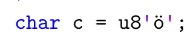

# 第八章 其他语言特性
有一些小的C++核心语言特性改动，它们会在本章描述。

## 8.1 嵌套命名空间
最早这个提案是在2003年提出的，C++标准委员会现在终于最终接受了它：
```cpp
namespace A::B::C {
  ...
}
```
它等价于:
```cpp
namespace A {
  namespace B {
    namespace C {
      ...
    }
  }
}
```
嵌套的inline命名空间还不支持。这是因为如果用了inline就不知道到底inline是针对最后一个还是对所有命名空间使用。

## 8.2 定于表达式求值顺序
很多代码库和C++书籍包含的代码首先给出符合直觉的假设，然后代码上看起来是有效的，但是严格来讲，这些代码可能产生未定义行为。一个例子是使用寻找并替换子字符串：
```cpp
std::string s = "I heard it even works if you don't believe";
s.replace(0,8,"").replace(s.find("even"),4,"sometimes")
                 .replace(s.find("you don✬t"),9,"I");
```
直觉上看起来这段代码是有效的，它将前8个字符替换为空，“even”替换为“sometimes”，将“you don't”替换为“I”：
```cpp
it sometimes works if I believe
```
然而，在C++17之前，结果是不保证的，因为，虽然`find()`调用返回从何处开始替换，但是当整个语句执行并且在结果被需要之前，这个调用可能在任何时候执行。实际上，所有`find()`，即计算待替换的起始索引，都可能在任何替换发生前被执行，因此结果是：
```cpp
it sometimes works if I believe
```
其他结果也是可能的：
```cpp
it sometimes workIdon’t believe
it even worsometiIdon’t believe
it even worsometimesf youIlieve
```
另一个例子是使用输出运算符来打印计算后的表达式的值：
```cpp
std::cout << f() << g() << h();
```
通常的假设是`f()`在`g()`之前被调用，两者又都在`h()`之前被调用。然而，这个假设是错误的。`f()`，`g()`和`h()`可以按任意顺序调用，这可能导致一些奇怪的，甚至是糟糕的结果，尤其是当这些调用互相依赖时

具体来说，考虑下面的例子，在C++17之前，这段代码会产生未定义行为：
```cpp
i = 0;
std::cout << ++i << ' ' << --i << '\n';
```
在C++17之前，他可能输出`1 0`，也可能输出`0 -1`，甚至是`0 0`。不管i是int还是用户定义的类型，都可能这样。（对于基本类型，一些编译器至少会warning这个问题）。

要修复这个未定义行为，一些运算符/操作符的求值被挑战，因此现在它们有确定的求值顺序：
+ 对于
  + `e1 [ e2 ]`
  + `e1 . e2`
  + `e1 .* e2`
  + `e1 ->* e2`
  + `e1 << e2`
  + `e1 >> e2`
e1保证在e2之前求值，它们的求值顺序是从左至右。

然而，相同函数的不同实参的求值顺序仍然是未定义的。即：
```cpp
e1.f(a1,a2,a3)
```
e1保证在a1 a2 a3之前求值。但是a1 a2 a3的求职顺序仍然是未定义的。
+ 所有赋值运算符
  + `e2 = e1`
  + `e2 += e1`
  + `e2 *= e1`
  + `...`
右手边的e1会先于左手变的e2被求值。
+ 最后，new表达式中
  + `new Type(e)`
分配行为保证在e之前求值，初始化新的值保证在任何使用初始化的值之前被求值。

上述所有保证对基本类型和用户定义类型都有效。

这样做的效果是，C++17后：
```cpp
std::string s = "I heard it even works if you don't believe";
s.replace(0,8,"").replace(s.find("even"),4,"sometimes")
                 .replace(s.find("you don✬t"),9,"I");
```
保证会改变s的值，变成：
```
it always works if you use C++17
```
因此，每个`find()`之前的替换都会在`find()`之前被求值。

另一个结果是，下面的语句
```cpp
i = 0;
std::cout << ++i << ' ' << --i << '\n';
```
其输出保证是`1 0`。

然而，对于其他大多数运算符而言，求值顺序仍然未定义。举个例子：
```cpp
i = i++ + i; // still undefined behavior
```
这里右手变的i可能在递增之前或者递增之后传递给左手变。

另一个使用new表达式求值顺序的例子是**在传值之前插入空格的函数**。

#### 向后兼容
新的求值顺序的保证可能影响既有程序的输出。这不是理论上可能，是真的。考虑下面的代码：
```cpp
#include <iostream>
#include <vector>

void print10elems(const std::vector<int>& v) 
{
    for (int i=0; i<10; ++i) {
        std::cout << "value: " << v.at(i) << '\n';
    }
}

int main()
{
    try {
        std::vector<int> vec{7, 14, 21, 28};
        print10elems(vec);
    }
    catch (const std::exception& e) { // handle standard exception
        std::cerr << "EXCEPTION: " << e.what() << '\n'; }
    catch (...) { // handle any other exception
        std::cerr << "EXCEPTION of unknown type\n"; 
    } 
}
```
因为这里的`vector<>`只有4个元素，程序会在`print10elems()`的循环中，调用`at()`时遇到无效索引抛出异常：
```cpp
std::cout << "value: " << v.at(i) << "\n";
```
在C++17之前，可能输出：
```
value: 7
value: 14
value: 21
value: 28
EXCEPTION: ...
```
因为`at()`可以在"value "输出之前求值，所以对于错误的索引可能直接跳过不输出"value "。

自C++17之后，保证输出：
```
value: 7
value: 14
value: 21
value: 28
value: EXCEPTION: ...
```
因为"value "一定在`at()`调用之前执行。

## 8.3 宽松的基于整数的枚举初始化
对于有固定基本类型的枚举，C++17允许你使用带数值的列表初始化。
```cpp
// unscoped enum with underlying type:
enum MyInt : char { };
MyInt i1{42};     // C++17 OK (C++17之前错误)
MyInt i2 = 42;    // 仍然错误
MyInt i3(42);     // 仍然错误
MyInt i4 = {42};  // 仍然错误

enum class Weekday { mon, tue, wed, thu, fri, sat, sun };
Weekday s1{0};    // C++17 OK (C++17之前错误)
Weekday s2 = 0;   // 仍然错误
Weekday s3(0);    // 仍然错误
Weekday s4 = {0}; // 仍然错误
```
类似的，如果Weekday有基本类型：
```cpp
// scoped enum with specified underlying type:
enum class Weekday : char { mon, tue, wed, thu, fri, sat, sun };
Weekday s1{0};    // C++17 OK (C++17之前错误)
Weekday s2 = 0;   // 仍然错误
Weekday s3(0);    // 仍然错误
Weekday s4 = {0}; // 仍然错误
```
对于没有指定基本类型的未限域枚举（不带class的enum），你仍然不能使用带数值的列表初始化：
```cpp
enum Flag { bit1=1, bit2=2, bit3=4 };
Flag f1{0}; // 仍然错误
```
注意，列表初始化还是不允许变窄（narrowing），因此你不能传递浮点值：
```cpp
enum MyInt : char { };
MyInt i5{42.2}; // 仍然错误
```
之所以提出这个特性，是想实现一种技巧，即基于原有的整数类型定义另一种新的枚举类型，就像上面MyInt一样。

实际上，C++17的标准库中的`std::byte`也提供这个功能，它直接使用了这个特性。

## 8.4 修复带auto和直接列表初始化一起使用产生的矛盾行为
C++11引入了统一初始化后，结果证明它和auto搭配会不幸地产生反直觉的矛盾行为：
```cpp
int x{42};      // initializes an int
int y{1,2,3};   // ERROR
auto a{42};     // initializes a std::initializer_list<int>
auto b{1,2,3};  // OK: initializes a std::initializer_list<int>
```
这些使用直接列表初始化（direct list initialization，不带`=`的花括号）造成的前后不一致行为已经得到修复，现在程序行为如下：
```cpp
int x{42};      // initializes an int
int y{1,2,3};   // ERROR
auto a{42};     // initializes an int now
auto b{1,2,3};  // ERROR now
```
注意这是一个非常大的改变，甚至可能悄悄的改变程序的行为。出于这个原因，编译器接受这个改变，但是通常也提供C++11版本的模式。对于主流编译器，比如Visual Studio 2015，g++5和clang3.8同时接受两种模式。

还请注意拷贝列表初始化（copy list initialization，带`=`的花括号）的行为是不变的，当使用auto时初始化一个`std::initializer_list<>`：
```cpp
auto c = {42}; // still initializes a std::initializer_list<int>
auto d = {1,2,3}; // still OK: initializes a std::initializer_list<int>
```
因此，现在的直接列表初始化（不带`=`）和拷贝列表初始化（带`=`）有另一个显著区别：
```cpp
auto a{42}; // initializes an int now
auto c = {42}; // still initializes a std::initializer_list<int>
```
推荐的方式是总是使用直接列表初始化（不带`=`的花括号）来初始化变量和对象。

## 8.5 十六进制浮点字面值
C++17标准化了十六进制的浮点值字面值（有些编译器早已在C++17之前就支持了）。这种方式尤其适用于要求精确的浮点表示（对于双精度浮点值，没法保证精确值的存在）。

举个例子：
```cpp
// lang/hexfloat.cpp
#include <iostream>
#include <iomanip>

int main() {
  // init list of floating-point values:
  std::initializer_list<double> values{
      0x1p4, // 16
      0xA, // 10
      0xAp2, // 40
      5e0, // 5
      0x1.4p+2, // 5
      1e5, // 100000
      0x1.86Ap+16, // 100000
      0xC.68p+2, // 49.625
  };
  
  // print all values both as decimal and hexadecimal value:
  for (double d : values) {
    std::cout << "dec: " << std::setw(6) << std::defaultfloat << d
              << " hex: " << std::hexfloat << d << '\n';
  }
}
```
这个程序使用不同的方式定义了不同的浮点值，其中包括使用十六进制浮点记法。新的记法是base为2的科学表示法：
+ significant/mantissa写作十六进制方式
+ exponent写作数值方式，解释为base为2

比如说，`0xAp2`是指定数值40（10乘以2的次方）。这个值也可以表示为`0x1.4p+5`，表示1.25乘以32（0.4是十六进制的四分之一，2的5次方是32）。

程序输出如下：
```
dec: 16     hex: 0x1p+4
dec: 10     hex: 0x1.4p+3
dec: 40     hex: 0x1.4p+5
dec: 5      hex: 0x1.4p+2
dec: 5      hex: 0x1.4p+2
dec: 100000 hex: 0x1.86ap+16
dec: 100000 hex: 0x1.86ap+16
dec: 49.625 hex: 0x1.8dp+5
```
如你说见，这个例子的浮点记法早已在C++11的`std::hexfloat`操作符上就已经支持了。

## 8.6 UTF-8字符串字面值
C++11支持以u8前缀表示的UTF-8字符串字面值。然而，这个前缀对于字符是不支持的。C++17修复了这个问题，你现在可以这样写：
```cpp
char c = u8'6'; // character 6 with UTF-8 encoding value
```
样可以保证字符值是UTF-8中字符‘6’的值。你可以使用所有的7bits US-ASCII字符，对于这些字符，UTF-8代码具有相同的值。换句话说，用这个指定的值和US-ASCII、ISO Latin-1、ISO-8859-15和基本Windows字符集的值都是一样的。通常，你的源代码的字符都会被解释为US-ASCII/UTF-8，所以前缀不是很重要。变量c的值几乎总是54（十六进制的36）。

对于源码中的字符和字符串字面值，C++标准化了你可以使用哪些字符，但是没有标准化这些字符对应的值。这些值取决于源代码字符集。当编译器生成可执行程序时，它会使用运行时字符集。源代码字符集集合总是7bits的US-ASCII，并且运行时字符集通常和源代码字符集一样。对于任何C++程序，有没有u8前缀这些字符和字符串字面值都是一样的。但是在很少见的情况下，可能不是这样。比如老式的IBM主机，仍然使用EBCDIC字符集，在这个字符集中字符‘6’的值是246（十六进制F6）。如果程序使用EBCDIC字符集，那么c的值将会是246而不是54，并且在UTF-8编码的平台上运行该程序时可能输出"¨o"，因为它对应ASCII值的246.在这种情况下前缀可能是必要的。

注意u8只能用于单个字符和UTF-8单字节字符。下面的初始化：

是不被允许的，因为这个德语字符在UTF-8是双字节，即195和182（十六进制C3 B6）。

总结来熟哦，所有允许的字符和字符串字面值如下：
+ 单字节US-ASCII和UTF-8可以使用**u8**
+ 双字节的UTF-16可以使用**u**
+ 四字节的UTF-32可以使用**U**
+ 没有指定编码的宽字符可以使用**l**，它可能是两字节也可能是四字节

## 8.7 异常声明成为类型的一部分
C++17开始异常处理声明成为一个函数的类型的一部分。也就是说，下面的两个函数现在有不同的类型：
```cpp
void f1();
void f2() noexcept; // different type
```
在C++17之前，这两个函数的类型是相同的。

这样的后果是，现在的编译器会检查是否你将不抛异常的函数传递给抛异常的函数指针：
```cpp
void (*fp)() noexcept;  // pointer to function that doesn’t throw
fp = f2;                // OK
fp = f1;                // ERROR since C++17
```
给抛异常的函数指针传递不抛异常的函数仍然有效：
```cpp
void (*fp2)();  // pointer to function that might throw
fp2 = f2;       // OK
fp2 = f1;       // OK
```
所以，这个新的特性不会破坏哪些没有使用noexcept作为函数指针的一部分的那些程序。

异常声明有无不能作为重载函数的依据：
```cpp
void f3();
void f3() noexcept; // ERROR
```
注意，其他规则是不受影响的。举个例子，下面的代码中你还是不能忽略基类noexcept声明：
```cpp
class Base {
public:
    virtual void foo() noexcept;
    ...
};

class Derived : public Base {
public:
    void foo() override; // ERROR: does not override
    ...
};
```
子类的`foo()`的类型与基类的`foo()`类型不一致，所以不允许重载，这个代码不能通过编译。即便没有指定override修饰符，还是不能编译，因为我们不能用更宽松的抛异常的版本来重载不抛异常的严格版本。

#### 使用条件异常声明
当使用条件异常声明时，函数的类型取决于条件为true还是false：
```cpp
void f1();
void f2() noexcept;
void f3() noexcept(sizeof(int)<4); // same type as either f1() or f2()
void f4() noexcept(sizeof(int)>=4); // different type than f3()
```
在这里，当代码编译时`f3()`的类型取决于条件：
+ 如果`sizeof(int)`为4（或者更多），最终的签名是
```cpp
void f3() noexcept(false);    // same type as f1()
```
+ 如果`sizeof(int)`小于4，最终签名是：
```cpp
void f3() noexcept(true);     // same type as f2()
```
因为`f4()`的异常条件与`f3()`相反，所以`f4()`的类型总是与`f3()`不一样（即保证`f3()`抛异常它就不抛，`f3()`不抛它就抛）。

老式的空异常声明仍然可以使用，但是C++17已经标为废弃：
```cpp
void f5() throw(); // same as void f5() noexcept but deprecated
```
动态的异常声明已经不再支持（它们在C++11时已经标为废弃）：
```cpp
void f6() throw(std::bad_alloc); // ERROR: invalid since C++17
```

#### 对泛型库的影响
让noexcept成为类型的一部分可能对一些泛型库造成影响。

比如，下面的程序截止C++14是有效的，但是在C++17中无法编译：
```cpp
// lang/noexceptcalls.cpp
#include <iostream>

template<typename T>
void call(T op1, T op2)
{
    op1();
    op2();
}

void f1() {
    std::cout << "f1()\n"; 
}

void f2() noexcept {
    std::cout << "f2()\n"; 
}

int main()
{
    call(f1, f2); // ERROR since C++17
}
```
原因是C++17中`f1()`和`f2()`的类型不一样，编译器在实例化模板调用`call()`的时候不能为两个类型找到相同的类型T。

在C++17下，你不得不用两个类型：
```cpp
template<typename T1, typename T2>
void call(T1 op1, T2 op2)
{
  op1();
  op2();
}
````
如果你想，或者不得不重载所有可能的函数类型，你需要付出双倍。来看`std::is_function<>`，主要的函数模板定义如下，通常T不是函数：
```cpp
// primary template (in general type T is no function):
template<typename T> struct is_function : std::false_type { };
```
这个模板继承自`std::false_type`，所以`is_function<T>::value`通常产生false。

对于那些的确是函数的类型，需要偏特化，它继承自`std::true_type`，所以成员value的值是true：
```cpp
// partial specializations for all function types:
template<typename Ret, typename... Params>
struct is_function<Ret (Params...)> : std::true_type { };
template<typename Ret, typename... Params>
struct is_function<Ret (Params...) const> : std::true_type { };
template<typename Ret, typename... Params>
struct is_function<Ret (Params...) &> : std::true_type { };
template<typename Ret, typename... Params>
struct is_function<Ret (Params...) const &> : std::true_type { };
```
C++17之前，它已经有24个偏特化来，因为函数可能有const和volatile修饰符，也可能有lvalue和rvalue引用修饰符，你重载的函数需要可变参数模板类型。

C++17后，偏特化的数量将会翻倍，因为有了新的noexcept修饰符，所以现在有48个：
```cpp
...
// partial specializations for all function types with noexcept:
template<typename Ret, typename... Params>
struct is_function<Ret (Params...) noexcept> : std::true_type { };
template<typename Ret, typename... Params>
struct is_function<Ret (Params...) const noexcept> : std::true_type { };
template<typename Ret, typename... Params>
struct is_function<Ret (Params...) & noexcept> : std::true_type { };
template<typename Ret, typename... Params>
struct is_function<Ret (Params...) const& noexcept> : std::true_type { };
```
没有实现noexcept重载的库可能编译不了一些代码，因为它们可能用了noexcept。

## 8.8 单参数的static_assert
C++17开始，之前`static_assert()`必须传的错误消息参数现在变成可选了。这意味着最后的诊断性消息完全平台特定。比如：
```cpp
#include <type_traits>

template<typename T>
class C {
  // OK since C++11:
  static_assert(std::is_default_constructible<T>::value,
                "class C: elements must be default-constructible");
                // OK since C++17:
  static_assert(std::is_default_constructible_v<T>);
  ...
};
```
没有传消息的断言使用了新的type trait后缀`_v`。

## 8.9 预处理条件`__has_include`
C++17扩展了预处理起，可以检查一个特定的头文件是否被include。比如：
```cpp
#if __has_include(<filesystem>)
# include <filesystem>
# define HAS_FILESYSTEM 1
#elif __has_include(<experimental/filesystem>)
# include <experimental/filesystem>
# define HAS_FILESYSTEM 1
# define FILESYSTEM_IS_EXPERIMENTAL 1
#elif __has_include("filesystem.hpp") # include "filesystem.hpp" # define HAS_FILESYSTEM 1
# define FILESYSTEM_IS_EXPERIMENTAL 1
#else
# define HAS_FILESYSTEM #if __has_include(<filesystem>)
# include <filesystem>
# define HAS_FILESYSTEM 1
#elif __has_include(<experimental/filesystem>)
# include <experimental/filesystem>
# define HAS_FILESYSTEM 1
# define FILESYSTEM_IS_EXPERIMENTAL 1
#elif __has_include("filesystem.hpp") # include "filesystem.hpp" # define HAS_FILESYSTEM 1
# define FILESYSTEM_IS_EXPERIMENTAL 1
#else
# define HAS_FILESYSTEM 0
#endif0
#endif
```
如果`#include`成功则`__has_include(...)`会求值为1(true)。如果不成功则没有什么影响。

## 8.10 后记
嵌套namespace定义最初由Jon Jagger在2003年于[https://wg21.link/n1524](https://wg21.link/n1524)提出。Robert Kawulak在2014年于[https://wg21.link/n4026](https://wg21.link/n4026)提出了新的提案。最后这个特性的公认措辞是由Robert Kawulak 和 Andrew Tomazos在[https://wg21.link/n4230](https://wg21.link/n4230)中给出。

重新定义后的求值顺序最初由Gabriel Dos Reis, Herb Sutter和Jonathan Caves在[https://wg21.link/n4228](https://wg21.link/n4228)中提出。最后这个特性的公认措辞是由Gabriel Dos Reis, Herb Sutter和Jonathan Caves在[https://wg21.link/p0145r3](https://wg21.link/p0145r3)中给出。

更宽松的枚举初始化最初由Gabriel Dos Reis在[https://wg21.link/p0138r0](https://wg21.link/p0138r0)中提出。最后这个特性的公认措辞是由Gabriel Dos Reis在[https://wg21.link/p0138r2](https://wg21.link/p0138r2)中给出。

修复带auto和直接列表初始化一起使用产生的矛盾行为最初由Ville Voutilainen在[ https://wg21.link/n3681](https://wg21.link/n3681)和[https://wg21.link/3912](https://wg21.link/3912)中提出。最后这个特性的公认措辞是由 James Dennett在[https://wg21.link/n3681](https://wg21.link/n3681)中给出。

十六进制浮点值最初由Thomas Koppe在[https://wg21.link/p0245r0](https://wg21.link/p0245r0)中提出。最后这个特性的公认措辞是由Thomas Koppe在[https://wg21.link/p0245r1](https://wg21.link/p0245r1)中给出。

UTF-8字符串字面值最初由 Richard Smith在[https://wg21.link/n4197](https://wg21.link/n4197)中提出。最后这个特性的公认措辞是由 Richard Smith在[https://wg21.link/n4267](https://wg21.link/n4267)中给出。

异常声明成为类型的一部分最初由Jens Maurer在[https://wg21.link/n4320](https://wg21.link/n4320)中提出。最后这个特性的公认措辞是由Jens Maurer在[https://wg21.link/p0012r1](https://wg21.link/p0012r1)中给出。

单参数的static_assert的公认措辞是由Walter E. Brown在[https://wg21.link/n3928](https://wg21.link/n3928)中给出。

预处理条件`__has_include`最初由Clark Nelson和RichardSmith在[https://wg21.link/p0061r0](https://wg21.link/p0061r0)中作为其中一部分提出。最后这个特性的公认措辞是由Clark Nelson和RichardSmith在[https://wg21.link/p0061r1](https://wg21.link/p0061r1)中给出。
